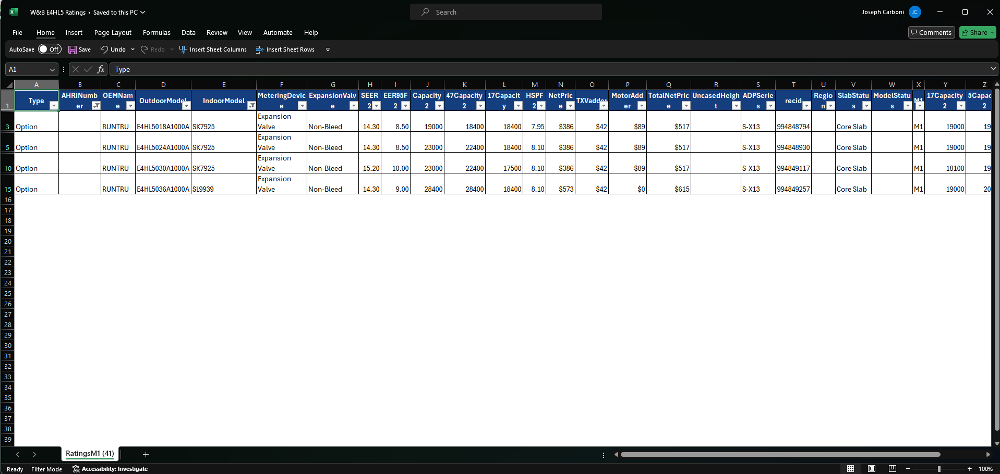
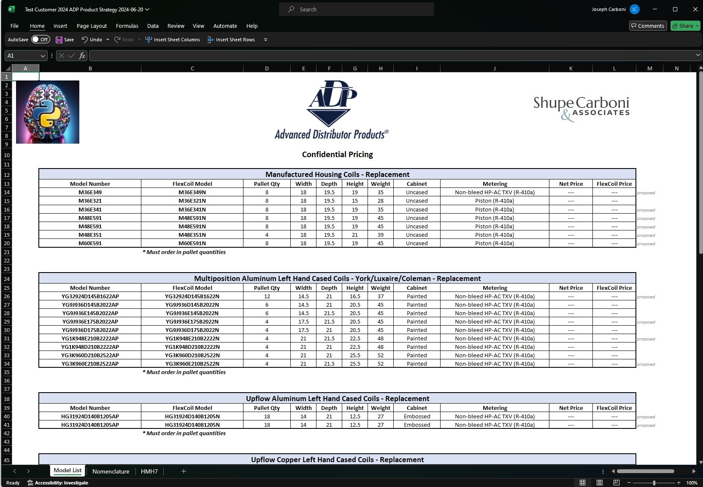

# Advanced Distributor Products (ADP)

ADP is the exclusive manufacturer of indoor cooling equipment featuring Microban® antimicrobial product protection. ADP evaporator coils and air handlers are "built" based on a variety of customizible features.

**These include**
* Product Series
* Paint Color
* Tonnage
* Width
* Depth (or Length)
* Height
* Metering Device
* kW Heat (Air Handlers)

The possible combinations of features number in the hundreds of thousands, so there is not a "catalog" of products to choose from. In addition to the model numbers themselves, there are a number of product specifications that lie beneath, not directly exposed in the model number itself.


Using a variety of reference tables, parts of the model number can be extracted and used to look up feature values and even calculate pricing. This is achieved by comparing a new model number, supplied by the user, and comparing it to regex patterns specific to each product series.

### Example of HE Series (i.e. HG30924D145B1205AP)
```python
class HE(ModelSeries):
    text_len = (18, 17)
    regex = r'''
        (?P<paint>[H|A|G|J|N|P|R|T|Y])
        (?P<mat>[A|E|G])
        (?P<scode>\d{2}|\d\D)
        (?P<meter>\d)
        (?P<ton>\d{2})
        (?P<depth>[A|C|D|E])
        (?P<width>\d{3})
        (?P<notch>[A|B])
        (?P<height>\d{2})
        (?P<config>\d{2})
        (?P<option>(AP)|[R|N])
    '''
    ...
```
The regex in every model series leverages [named capture groups](https://developer.mozilla.org/en-US/docs/Web/JavaScript/Reference/Regular_expressions/Named_capturing_group) for each component of the model number, as described by model nomenclatures.

These Named Capture Groups are exported into a dictionary upon instantiation of the ModelSeries object and persisted as `attributes`
```python
# adp-models/model_series.py

class ModelSeries()
    def __init__(self, session: Session, re_match: re.Match):
        self.attributes = re_match.groupdict()
        ...
```

Once a match is made to one of these models, reference files and objects are used to define all features (cabinet color, w/d/h, orientation, etc.) as well as the zero discount price. Some mappings are contained in the parent `ModelSeries` class so that they are available to all series, and some are local to only a particular series.

Example of some cross references set up for HE Series:
```python
# adp-models/models.py

class HE(ModelSeries)
    ...
    mat_config_map = {
        'E': {
            '01': 'CU_VERT',
            '05': 'CU_VERT',
            '20': 'CU_MP',
            '22': 'CU_MP',
        },
        'G': {
            '01': 'AL_VERT',
            '05': 'AL_VERT',
            '20': 'AL_MP',
            '22': 'AL_MP',
        },
    }
    orientations = {
        '00': ('Right Hand', 'Uncased'),
        '04': ('Left Hand', 'Uncased'),
        '01': ('Right Hand', 'Upflow'),
        '05': ('Left Hand', 'Upflow'),
        '20': ('Right Hand', 'Multiposition'),
        '22': ('Left Hand', 'Multiposition'),
    }
    ...
```
And some examples of using the information in `attributes` to start defining features
```python
# adp-models/models.py

class HE(ModelSeries)
    ...
    def __init__(self, session: Session, re_match: re.Match):
        super().__init__(session, re_match)  # initializes attributes
        width: int = int(self.attributes["width"])
        if width % 10 == 2:
            self.width = width / 10 + 0.05
        else:
            self.width = width / 10
        self.depth = self.coil_depth_mapping[self.attributes["depth"]]
        height: int = int(self.attributes["height"])
        self.height = height + 0.5 if self.depth != 19.5 else height
        pallet_sql = f"""
            SELECT "{self.height}"
            FROM he_pallet_qty
            WHERE width = :width;
        """
        pallet_params = dict(width=self.width)
        self.pallet_qty = ADP_DB.execute(
            session=session, sql=pallet_sql, params=pallet_params
        ).scalar_one()
    ...
```
Every `ModelSeries` object implements its own `record` method, which instantiates a standard `dict` object by updating the `ModelSeries` implementation of `record`, in which all possible columns are contained and set to `None`, and updates only relevant values. This method is used later to build a table of all model records.

Example using the HE Series
*Note: `Fields` is a string enum, which I'm using throughout as my references to table fields instead of typing out the string values. the `formatted` method returns the value in title casing.*
```python
# adp-models/models.py

class HE(ModelSeries)
    ...
    def record(self) -> dict:
        model_record = super().record()
        values = {
            Fields.MODEL_NUMBER.value: str(self),
            Fields.CATEGORY.value: self.category(),
            Fields.MPG.value: self.mat_grp,
            Fields.SERIES.value: self.__series_name__(),
            Fields.TONNAGE.value: self.tonnage,
            Fields.PALLET_QTY.value: self.pallet_qty,
            Fields.WIDTH.value: self.width,
            Fields.DEPTH.value: self.depth,
            Fields.HEIGHT.value: self.height,
            Fields.WEIGHT.value: self.weight,
            Fields.CABINET.value: self.cabinet_config.name.title(),
            Fields.METERING.value: self.metering,
            Fields.ZERO_DISCOUNT_PRICE.value: self.zero_disc_price,
            Fields.RATINGS_AC_TXV.value: self.ratings_ac_txv,
            Fields.RATINGS_HP_TXV.value: self.ratings_hp_txv,
            Fields.RATINGS_PISTON.value: self.ratings_piston,
            Fields.RATINGS_FIELD_TXV.value: self.ratings_field_txv,
        }
        model_record.update(values)
        return model_record

    ...
```
All of these `ModelSeries` subclasses are then packaged into a tuple for a convenient import
```python
MODELS = (HE,HD,HH,V,MH,SC,F,B,S,CP,CE,CF)
```
A separate `Validator` class is used to compare the value in a cell to the model's regex. If the regex matches on the content, `is_model` returns an instance of the `ModelSeries` class, otherwise `False`. The text length attribute (a tuple) is also used as another check.

```python
# validator.py
import re
from app.db import Session
from app.adp.adp_models.model_series import ModelSeries


class Validator:
    def __init__(
        self, db_session: Session, raw_text: str, model_series: ModelSeries
    ) -> None:
        self.raw_text = (
            (str(raw_text).strip().upper().replace(" ", "").replace("-", ""))
            if raw_text
            else None
        )
        self.text_len = len(self.raw_text) if self.raw_text else 0
        self.model_series = model_series
        self.session = db_session

    def is_model(self) -> ModelSeries | bool:
        if self.text_len not in self.model_series.text_len or not self.raw_text:
            return False
        model = re.compile(self.model_series.regex, re.VERBOSE)
        model_parsed = model.match(self.raw_text)
        if model_parsed:
            return self.model_series(session=self.session, re_match=model_parsed)
        else:
            return False

```
This validator is used in a loop that tries all `ModelSeries` objects contained in `MODELS`. When a match is found, the ModelSeries objest is returned. ModelSeries can be converted into a dixt with the `record` method. This is what underlies the `adp-coil-programs`, `adp-ah-programs`, and `model-lookup` resources, which take only a model number to build the product pricing.

## Ratings

AHRI ratings may be uploaded in a file, using the same output format as ADP's COMPASS tool at `POST /vendors/adp/adp-program-ratings/{adp_customer_id}`


*Example output from Compass: Can be uploaded as-is to register ratings with a customer through the API*

## Strategy File
ADP has traditionally offered "Product Strategies" in the form of stylized Excel documents. This API will procedurally generate such files for download upon request. A link can be requested by requesting a link at `POST /vendors/adp/programs/{adp_customer_id}/download`

The `generate_program` method, defined in `workbook_factory.py`, takes care of collecting the customer's data and feeding it into an excel document generation module that relies on openpyxl, called `pricebook.py`. `generate_program` returns the file, which is packaged in an `XLSXResponse`.


*Example of a downloadble product strategy: First tab - models and pricing, Second tab - nomenclatures, 3rd+ tabs: AHRI ratings associated with models on 1st tab*

## Resource List
* adp-coil-programs
* adp-ah-programs
* adp-customers
* adp-program-parts
* adp-program-ratings
* adp-material-group-discounts
* adp-snps
* adp-quotes
* adp-quote-products